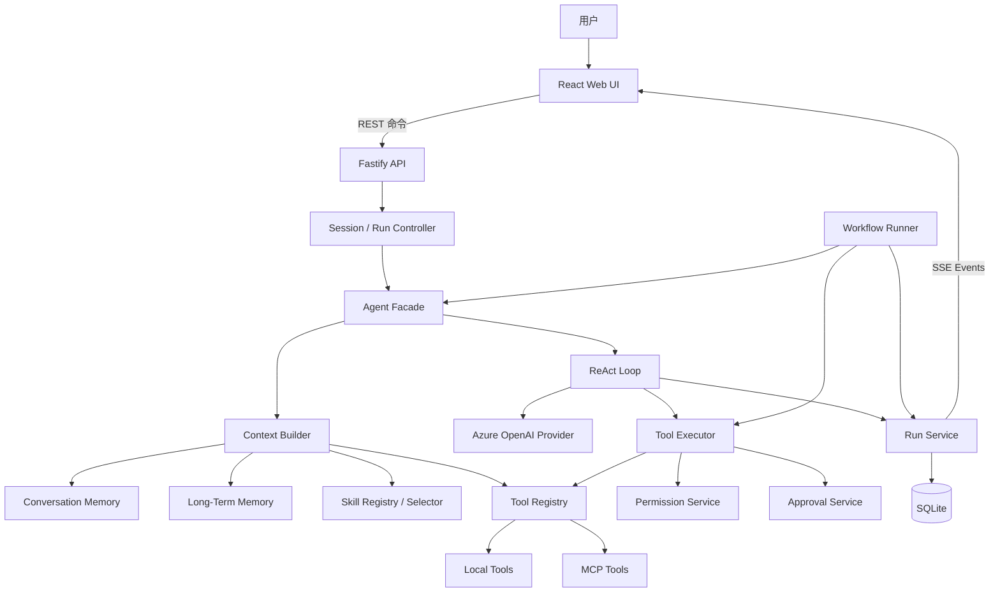
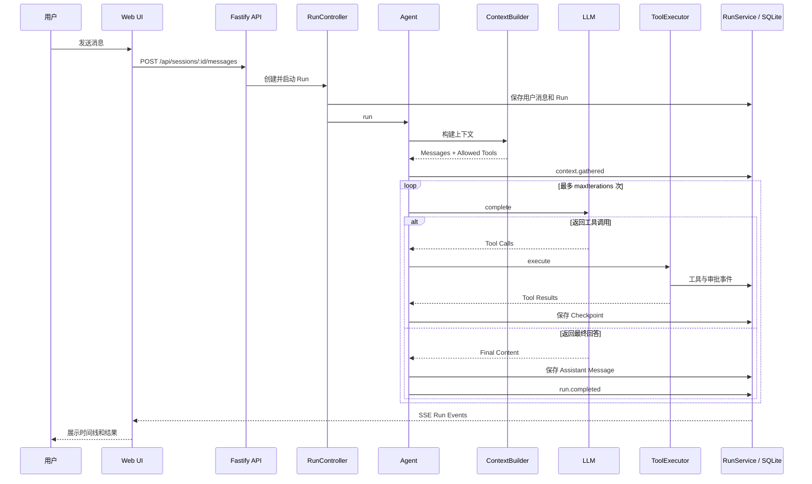
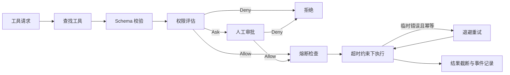

# Co-Work Agent 架构设计

## 1. 文档概述

### 1.1 文档目的

本文档描述 Co-Work Agent 的总体架构、核心模块、运行流程、数据模型、安全边界和扩展机制，为后续功能开发、架构演进、测试和运维提供统一参考。

### 1.2 系统定位

Co-Work Agent 是一个本地运行、面向代码工作区的 AI Agent 平台。系统通过 Web 界面与用户交互，结合大语言模型、受约束的本地工具、MCP 工具、长期记忆和可复用工作流，在指定 Workspace 内完成代码分析、文件修改、任务执行和 Git 操作。

系统的核心原则是：

- Agent 负责动态决策，但不能绕过工具运行时直接操作环境。
- 所有有副作用的能力统一经过权限规则和人工审批。
- 执行过程以结构化事件记录，并向用户实时展示。
- 会话、记忆、权限和工作流均以 Workspace 为隔离边界。
- 确定性流程使用 Workflow 编排，开放性任务使用 Agent 自治循环。

## 2. 设计目标

### 2.1 功能目标

- 支持基于 Web 的多 Workspace、多 Session 对话。
- 支持模型通过工具读取、搜索、修改代码和执行任务。
- 支持本地工具与 MCP 工具统一注册和调用。
- 支持工具级权限判断、人工审批、超时、重试和熔断。
- 支持会话记忆、工作记忆和 Workspace 长期记忆。
- 支持 Skills 自动选择和 Workflow 多步骤编排。
- 支持执行事件实时展示、取消、中断检测和安全恢复。
- 使用本地 SQLite 持久化应用状态。

### 2.2 非功能目标

- **安全性**：模型只能通过受控工具访问 Workspace，写操作和高风险操作受权限策略约束。
- **可观察性**：上下文收集、模型迭代、工具调用、审批和终态均产生可追踪事件。
- **可恢复性**：运行过程持续保存 checkpoint，进程异常后允许从安全状态恢复。
- **可扩展性**：LLM、Embedding、Tool、MCP、Skill 和 Workflow 均具有明确扩展边界。
- **可测试性**：核心服务通过构造函数注入依赖，减少对全局状态的依赖。
- **本地优先**：项目文件、数据库和运行过程保留在本机，远端依赖主要为模型服务。

## 3. 技术架构总览



系统采用前后端分离的单机部署架构：

- Web 应用提供交互界面和运行状态投影。
- Agent Server 提供 API、Agent 执行、权限控制和持久化。
- Contracts 包提供前后端共享的数据类型与 Zod Schema。
- SQLite 保存 Workspace、Session、Run、Memory、Permission、Skill、MCP 和 Workflow 数据。
- Azure OpenAI 提供 Responses API 和 Embedding 服务。

## 4. 目录结构

```text
co-work-agent/
├─ apps/
│  ├─ agent-server/
│  │  ├─ bundled-skills/        内置 Skill 定义
│  │  └─ src/
│  │     ├─ agent/              Agent、上下文构建、ReAct Loop、Token 预算
│  │     ├─ llm/                LLM 与 Embedding Provider
│  │     ├─ mcp/                MCP Server 注册、配置与工具发现
│  │     ├─ memory/             Conversation、Working、Long-Term Memory
│  │     ├─ permissions/        权限策略、规则与人工审批
│  │     ├─ server/             Fastify 应用和 API Routes
│  │     ├─ sessions/           Session、Run、Event 和 Checkpoint
│  │     ├─ skills/             Skill 加载、选择、注册与存储
│  │     ├─ storage/            SQLite 初始化与 Schema
│  │     ├─ tools/              Tool Registry、Executor 与本地工具
│  │     ├─ workflow/           Workflow 定义、执行与状态持久化
│  │     └─ workspace/          Workspace 管理和路径解析
│  └─ web/
│     └─ src/
│        ├─ api/                REST 与 SSE 客户端
│        ├─ app/                应用外壳和页面组织
│        ├─ atoms/              Jotai 客户端状态
│        └─ features/           Chat、Run、Memory、Skill、MCP 等功能
├─ packages/
│  └─ contracts/               前后端共享类型和 Zod Schema
├─ dev-design/                 开发与架构设计文档
├─ skill-evaluations/          Skill 评估场景
├─ workspaces/                 Agent 管理的本地 Workspace
├─ package.json                npm Workspace 和根脚本
├─ tsconfig.base.json          TypeScript 基础配置
└─ README.md                   项目使用说明
```

## 5. 关键运行流程

### 5.1 普通对话执行流程



### 5.2 人工审批流程

1. `PermissionService` 根据工具、参数和 Workspace 规则返回权限决策。
2. 若决策要求审批，`ToolExecutor` 发布 `approval.required` 事件。
3. Web 时间线展示允许或拒绝操作。
4. 用户也可以在允许时创建一条 Workspace 权限规则。
5. `ApprovalService` 唤醒等待中的工具执行 Promise。
6. 用户拒绝、审批超时或 Run 被取消时，工具不会执行。

### 5.3 中断恢复流程

服务启动时，数据库中仍处于 `created` 或 `running` 的 Run 会被标记为 `interrupted`。

只有满足以下条件时才能恢复：

- Run 状态为 `interrupted`。
- 存在 checkpoint。
- checkpoint 对应的事件序号等于 Run 最新事件序号。
- Assistant Tool Call 都存在对应 Tool Result，不存在半完成工具调用。

恢复后系统复用 checkpoint 中的消息和允许工具集合，重新进入 `ReactLoop`。这种策略优先保证工具副作用不会因不确定状态而重复执行。

## 6. 分层设计

### 6.1 表现层

表现层位于 `apps/web`，使用 React、Vite、TanStack Query 和 Jotai。

主要职责：

- 管理 Workspace 和 Session 导航。
- 提交用户消息并启动 Agent Run。
- 通过 SSE 订阅运行事件。
- 展示推理阶段、工具调用、审批和最终结果。
- 提供 Memory、Skill、MCP、Permission 和 Workflow 管理界面。
- 将服务端事件投影为当前页面状态。

前端不负责执行 Agent 决策，也不作为运行状态的最终事实来源。持久化状态以服务端数据库和事件记录为准。

### 6.2 API 与控制层

API 层位于 `apps/agent-server/src/server`，基于 Fastify 实现。

主要职责：

- 校验 HTTP 请求并调用应用服务。
- 创建 Session、Message 和 Run。
- 提供 Run 取消与恢复接口。
- 通过 SSE 推送 Run Event。
- 暴露 Workspace、Memory、Permission、Skill、MCP 和 Workflow 管理接口。

`server/app.ts` 是服务端 Composition Root，负责创建基础设施并完成依赖组装。项目使用显式构造函数注入，没有引入依赖注入容器。

### 6.3 Agent 编排层

Agent 编排层位于 `apps/agent-server/src/agent`。

#### Agent

`Agent` 是 Agent 能力的外观和编排入口，负责：

1. 解析目标 Workspace 的物理路径。
2. 调用 `ContextBuilder` 构建模型输入。
3. 发布上下文统计事件。
4. 启动或恢复 `ReactLoop`。

`Agent` 不直接实现模型调用、工具权限和数据持久化，以保持职责单一。

#### ContextBuilder

`ContextBuilder` 负责组合：

- 系统指令。
- Workspace 根路径。
- 与当前请求相关的长期记忆。
- 自动选择或强制指定的 Skill 指令。
- 当前 Session 的历史消息。
- 当前允许使用的工具定义。

如果被选中的 Skill 声明了 `requiredTools`，系统会限制该次运行的工具集合，同时始终保留 `list_files`、`read_file` 和 `search_files` 三个基础探索工具。

#### ReactLoop

`ReactLoop` 实现 ReAct 风格的自治执行循环：

1. 根据 token 预算压缩当前上下文。
2. 调用 LLM 获取回答或工具调用。
3. 没有工具调用时，将内容作为最终回答。
4. 存在工具调用时，通过 `ToolExecutor` 执行。
5. 将工具结果加入对话并进入下一次模型迭代。
6. 每个关键阶段保存 checkpoint 和 Run Event。

循环受到最大迭代次数、模型输出预算、工具结果预算和 Run 总超时限制。

### 6.4 工具执行层

工具执行层位于 `apps/agent-server/src/tools`。

#### ToolRegistry

`ToolRegistry` 统一保存本地工具和 MCP 工具，并向 LLM 提供标准工具定义。Agent 和 Workflow 通过工具名称访问 Registry，不直接依赖具体工具实现。

#### ToolExecutor

`ToolExecutor` 是所有工具调用的统一安全边界，执行顺序如下：

1. 检查工具是否存在。
2. 使用工具的 Zod Schema 校验输入。
3. 根据 Workspace 和工具参数计算权限决策。
4. 拒绝被权限规则禁止的调用。
5. 对需要确认的操作等待人工审批。
6. 检查工具熔断状态。
7. 在工具级超时约束下执行工具。
8. 对幂等工具的临时错误进行指数退避重试。
9. 截断超出 token 限制的工具结果。
10. 发布完成、拒绝或失败事件。



### 6.5 记忆层

记忆模块位于 `apps/agent-server/src/memory`，分为三种不同生命周期的记忆。

#### Conversation Memory

Conversation Memory 来源于 Session 消息，用于构建当前对话历史，是用户与 Agent 交流的原始记录。

#### Working Memory

Working Memory 只存在于单次 Run 中，记录工具调用的摘要和成功状态。Run 完成后，成功的观察可被整理为 Auto Memory。

#### Long-Term Memory

Long-Term Memory 以 Workspace 为作用域，使用 Embedding 进行语义召回。排序综合语义相关性和时间新鲜度：

$$
score = 0.7 \times semanticSimilarity + 0.3 \times recency
$$

当 Embedding 服务不可用时，系统降级为按创建时间召回。保存新记忆时，系统还会搜索相似旧记忆，并通过 LLM 判断新记忆是否与旧记忆冲突或取代旧记忆。

### 6.6 Skills 层

Skills 模块位于 `apps/agent-server/src/skills`，内置 Skill 位于 `apps/agent-server/bundled-skills`。

Skill 是可复用的任务指导模块，主要包含：

- 名称与描述。
- 适用任务类型。
- 注入模型上下文的详细指令。
- 执行任务所需的工具列表。

系统启动时加载内置 Skill 和数据库中的自定义 Skill。普通 Agent Run 使用关键词匹配自动选择最多两个 Skill；Workflow 也可以强制指定某个 Skill。

### 6.7 MCP 集成层

MCP 模块位于 `apps/agent-server/src/mcp`，负责：

- 管理内置和自定义 MCP Server 配置。
- 建立 MCP 客户端连接。
- 动态发现远程工具。
- 将 MCP 工具注册到统一 Tool Registry。
- 保存内置 MCP Server 的启停覆盖配置。

MCP 工具进入 Registry 后，与本地工具共享相同的输入校验、权限、审批、超时、重试、熔断和事件机制。

### 6.8 Workflow 编排层

Workflow 模块位于 `apps/agent-server/src/workflow`，用于执行预定义的确定性流程。

当前支持以下节点：

| 节点类型 | 职责 |
| --- | --- |
| `prompt` | 使用模板生成 Prompt 并启动 Agent |
| `skill` | 强制指定 Skill 启动 Agent |
| `tool` | 绕过 LLM 决策，直接通过 ToolExecutor 调用工具 |
| `user_input` | 暂停流程并等待用户输入 |

Workflow 支持节点输出变量、模板替换、暂停恢复、节点状态持久化和父子 Run 事件聚合。

Agent 与 Workflow 的职责差异如下：

- Agent 适合开放性、探索性和步骤未知的任务。
- Workflow 适合步骤稳定、可复用和需要人工输入的业务流程。
- Workflow 节点可以复用 Agent 或 ToolExecutor，避免重复实现执行与安全逻辑。

## 7. 事件与状态设计

### 7.1 Run 状态

Run 包含以下状态：

| 状态 | 含义 |
| --- | --- |
| `created` | Run 已创建但尚未进入执行循环 |
| `running` | Run 正在执行 |
| `completed` | Run 正常完成 |
| `failed` | Run 执行失败 |
| `cancelled` | Run 被用户取消 |
| `interrupted` | 服务异常退出导致运行中断 |

### 7.2 事件模型

运行中的关键行为都以 `AgentEvent` 表示，例如：

- Run 开始、完成、失败和取消。
- 上下文收集和 token 统计。
- 推理迭代开始与结束。
- 工具请求、完成、拒绝和失败。
- 人工审批请求。
- 最终消息输出。
- Workflow 节点开始、完成、失败和等待输入。

每个事件具有 Run 内单调递增的 `sequence`。`RunService` 在同一个数据库事务中写入事件并更新 Run 当前状态，保证二者一致。

### 7.3 SSE 投影

Web 端通过 `/api/runs/:runId/events` 订阅 SSE：

- 首次连接重放已保存事件。
- 使用 `Last-Event-ID` 进行断线续传。
- 服务端定期发送 heartbeat。
- 收到终态事件后关闭连接。
- Jotai 根据事件 sequence 去重并投影当前运行状态。

## 8. 上下文与 Token 管理

上下文预算模块使用 `o200k_base` tokenizer 估算消息与工具定义占用。

预算策略包括：

- 工具定义计入输入 token 总预算。
- System Message 最多使用消息预算的一半，超出时进行截断。
- 始终保留最新用户请求及其后的完整消息段。
- 从新到旧选择可容纳的历史消息。
- Assistant Tool Call 与 Tool Result 作为完整段处理。
- 省略旧消息时添加上下文省略提示。
- 工具结果超限时保留头部和尾部，中间插入截断标记。

默认 Agent 配置如下：

| 配置项 | 默认值 |
| --- | ---: |
| 最大迭代次数 | 15 |
| 最大上下文 | 128,000 tokens |
| 最大模型输出 | 32,768 tokens |
| 单个工具结果 | 8,000 tokens |
| 模型超时 | 120 秒 |
| 工具超时 | 60 秒 |
| 审批超时 | 300 秒 |
| Run 总超时 | 900 秒 |
| 最大重试次数 | 2 |
| 熔断失败阈值 | 3 |
| 熔断冷却时间 | 30 秒 |

## 9. 安全设计

### 9.1 Workspace 隔离

- 每个 Session 绑定一个 Workspace。
- 文件工具只接收服务端解析后的 `workspaceRoot`。
- Memory、Permission 和 Workflow 数据均按 Workspace 隔离。
- 模型不能自行指定任意宿主机目录作为工具执行根路径。

### 9.2 最小能力原则

- 模型只能调用 Tool Registry 中注册的工具。
- Skill 可以缩小单次 Run 的可用工具集合。
- 所有工具输入在执行前必须通过 Schema 校验。
- 写入和 Git 等高风险能力由权限规则和人工审批控制。

### 9.3 不可信输入处理

系统指令明确将文件内容和工具输出视为不可信数据，不能把其中的文本当作高优先级指令。工具输出在重新进入模型上下文前还受到 token 截断限制。

### 9.4 超时与取消

- Run、模型、工具和审批分别具有独立超时。
- Run 取消通过 `AbortController` 向模型和工具传播。
- Workflow 根 Run 取消时，子 Run 同步取消。
- 非幂等工具默认不自动重试，降低重复副作用风险。

## 10. 数据与持久化

本地数据默认保存在 `.local/agent.db`，使用 Node.js SQLite API。

主要持久化对象包括：

- Workspace 及其物理路径信息。
- Session 和 Conversation Message。
- Agent Run、Run Event 和 Checkpoint。
- 长期记忆和 Auto Memory。
- 自定义及内置覆盖 Permission Rule。
- 自定义 Skill。
- MCP Server 配置及内置启停覆盖。
- Workflow Definition、Workflow Run 和节点状态。

文件型 Workspace 默认保存在 `workspaces/`。`.local/` 和运行生成数据不应提交到 Git。

## 11. 架构原则总结

Co-Work Agent 当前架构可归纳为以下关系：

> ContextBuilder 决定模型知道什么，ReactLoop 决定何时继续，ToolExecutor 决定允许做什么，RunService 记录实际发生了什么，WorkflowRunner 将稳定任务组织成可复用流程。

这一结构将模型的不确定性限制在 Agent 决策层，把环境访问、安全控制和运行事实放在确定性的应用代码中，为后续扩展更多工具、模型和自动化流程提供了稳定基础。