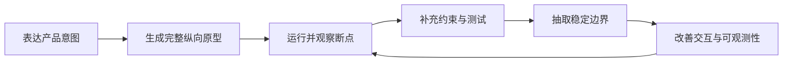
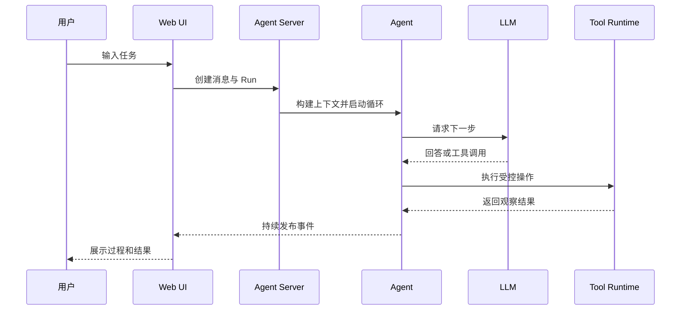
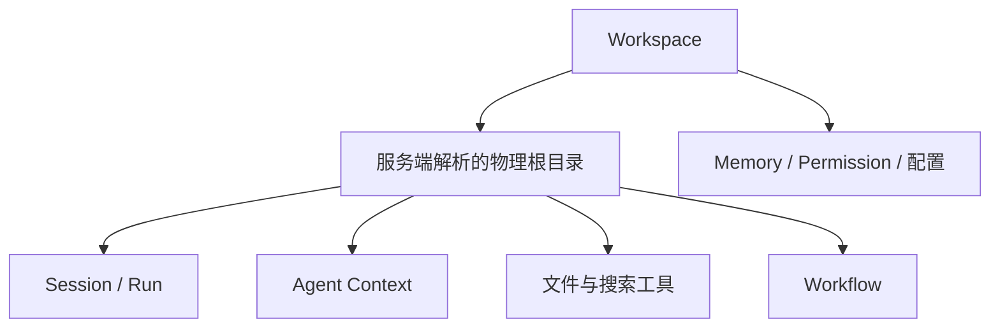
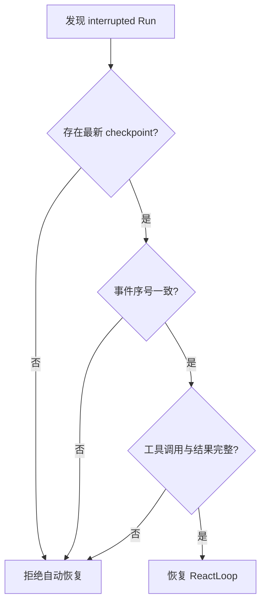
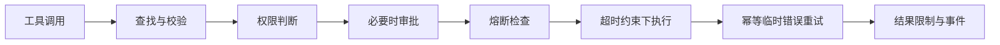
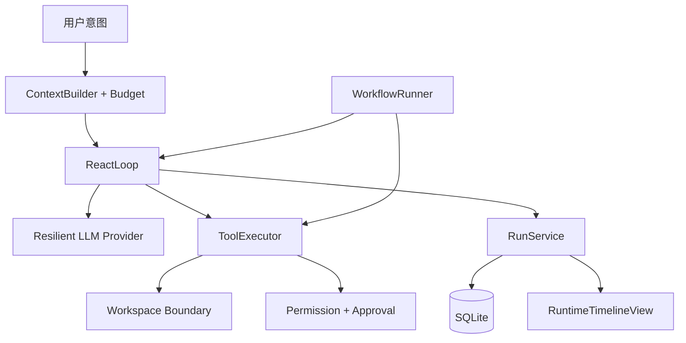

# Co-Work Agent：一次 Vibe Coding 的实现演进

## 1. 文档目的

本文记录 Co-Work Agent 如何通过 Vibe Coding，从一个完整但粗糙的纵向原型，逐步演进为具备 Workspace 隔离、工具安全、运行恢复、上下文预算和实时可观测性的本地 AI Agent。

这里的 Vibe Coding 不是“只描述想法，让模型一次性生成全部代码”，而是一种以可运行反馈为中心的开发方式：

1. 先建立能够端到端运行的产品切片。
2. 在真实交互中观察不自然、易出错或难以解释的地方。
3. 把模糊的不适转化为具体的系统约束。
4. 用测试固定约束，再重构职责边界。
5. 继续运行、继续观察，直到交互体验和内部模型逐渐一致。

Co-Work Agent 的演进重点不是功能数量持续增加，而是开发者与 Agent 在短反馈循环中不断回答几个问题：它操作的是哪个目录？失败后谁来处理？运行中断后从哪里继续？上下文太长怎么办？浏览器断线后看到的状态是否可信？用户能否理解 Agent 正在做什么？

## 2. Vibe Coding 的总体节奏

整个实现过程可以概括为五个循环：

这些循环并非严格按模块依次完成。前端、Agent、工具和持久化经常同时调整，因为一次真实交互会穿过整个系统。例如“工具失败后页面没有正确反馈”看似是 UI 问题，实际会同时涉及 ReactLoop 的异常语义、共享事件 Schema、RunService 的持久化和前端时间线投影。

这种跨层联动是本项目 Vibe Coding 的主要特征：从用户体验出发定位问题，再沿执行链向内修正，而不是先孤立地设计所有子系统。

## 3. 第一阶段：先让完整体验跑起来

### 3.1 先确定 Agent 的运行方向

开始生成代码之前，首先需要确定 Co-Work Agent 不是一个只返回文本的聊天机器人，而是一个能够在本地 Workspace 中持续观察、决策和执行的任务型 Agent。这个定位决定了系统采用 ReAct 作为核心运行机制。

选择 ReAct 后，运行方向也随之明确：

- 模型负责理解目标、拆解问题和动态选择下一步。
- 确定性代码负责上下文组装、工具执行、权限和状态记录。
- 模型不能直接访问本机，只能调用系统注册的工具。
- 每次推理、工具调用和状态变化都要转化为结构化事件。
- Agent 必须受到最大迭代次数、超时、取消和权限规则约束。

这个阶段同时设计了运行分层，避免把模型调用、工具副作用和界面状态混在一个循环中：

| 运行层 | 核心职责 |
| --- | --- |
| 交互层 | 接收用户目标，展示 Session、Run 和实时事件 |
| API 与控制层 | 创建 Run、处理取消与审批，协调执行生命周期 |
| Agent 编排层 | 构建上下文并驱动 ReAct 循环 |
| 模型层 | 返回推理结果、工具调用或最终回答 |
| 工具运行层 | 校验输入，在权限约束下执行本地或 MCP 工具 |
| 状态与记忆层 | 保存消息、事件、运行状态、长期记忆和配置 |

在技术架构上，项目采用本地运行的前后端分离 Monorepo。Web 只负责命令提交与状态投影，Agent Server 是运行事实和安全控制的中心，共享 Contracts 保证两端使用同一套类型与事件 Schema，SQLite 则提供无需额外服务的本地持久化。

技术栈的选择服务于“本地优先、端到端类型安全、快速反馈”三个目标：

| 范围 | 技术选择 | 选择原因 |
| --- | --- | --- |
| 工程组织 | TypeScript + npm Workspaces | 前后端统一语言，共享类型并保持 Monorepo 开发体验 |
| Web | React、Vite、TanStack Query、Jotai | 快速构建交互界面，分别管理服务端数据和运行时投影 |
| Agent Server | Node.js、Fastify、Zod | 提供轻量 API、流式响应和运行时输入校验 |
| 模型 | Azure OpenAI Responses API | 支持模型响应、工具调用和结构化输出 |
| 本地存储 | SQLite | 无需外部数据库，适合本地优先部署和事务化事件记录 |
| 工具扩展 | 内置 Tool Registry + MCP | 同时支持本地能力和外部工具生态 |
| 实时通信 | REST + SSE | REST 处理命令，SSE 持续推送单向运行事件 |
| 测试 | Vitest | 与 TypeScript/Vite 工具链一致，适合快速单元反馈 |

这些前置决策提供了第一版生成代码所需的“方向盘”：ReAct 定义运行循环，分层定义职责边界，架构定义组件关系，技术栈定义具体落地方式。它们不是一次性定稿的完整设计，而是足以支持第一个可运行版本、并允许后续根据反馈继续修正的起点。

### 3.2 从纵向切片开始

项目没有先分别完成数据库层、服务层和 UI 层，再等待最后集成，而是一开始就搭建了可运行的纵向切片：

- npm Workspaces 管理 Agent Server、Web 和共享 Contracts。
- React/Vite 提供聊天与管理界面。
- Fastify 暴露 Session、Run、Memory、Permission、Skill、MCP 和 Workflow API。
- Azure OpenAI Provider 提供模型与 Embedding 能力。
- `ContextBuilder` 组织模型上下文。
- `ReactLoop` 驱动模型与工具的多轮交互。
- 本地工具和 MCP 工具提供环境操作能力。
- Permission 与 Approval 控制有副作用的操作。
- SQLite 保存 Session、Run、Event、Memory 和配置数据。
- Web 时间线显示 Agent 的执行过程。

这个阶段优先验证的是产品闭环，而不是每个边界是否已经完美：

一次性跑通这条链路的价值，是尽早暴露系统真正困难的部分。很多问题在模块设计图中并不明显，只有模型开始调用工具、用户切换 Workspace、浏览器订阅事件后才会出现。

### 3.3 用文档校准产品意图

原型运行后，项目补充了安装方式、环境变量、启动命令和能力说明。这一步在 Vibe Coding 中很重要：自然语言不只用来向模型发出编码请求，也用来反向检查实现是否仍符合产品意图。

当 README 能够明确描述 Local-first、Workspace 隔离、人工审批、Memory、Skill、MCP 和 Workflow 时，这些概念便从临时代码变成项目契约。后续调整可以继续追问：新实现是否仍满足这些承诺？

## 4. 第二阶段：把运行中的不适变成边界

### 4.1 Workspace 不能只是筛选条件

原型已经存在 Workspace 数据结构和 API，但在真实使用中，仅在数据库记录一个 Workspace 并不够。Agent 最终操作的是物理目录；如果 Session、Workflow 和文件工具各自解析路径，它们可能对“当前项目”产生不同理解。

于是 Workspace 被强化为真正的执行边界：

- Workspace Service 负责创建和解析受管理目录。
- Session 与 Run 绑定 Workspace。
- Agent 和 Workflow 从服务端获取可信工作目录。
- 文件、搜索和写入工具统一接受解析后的 Workspace Root。
- Memory、Permission 和配置页面按 Workspace 组织。
- Web 增加 Workspace 创建与切换流程。

这次调整体现了典型的 Vibe Coding 收敛过程：先让多 Workspace 的体验存在，再通过实际执行发现“路径归属”才是控制点，最后把这个隐含假设提升为明确架构规则。

### 4.2 工具报错不等于 Agent 崩溃

另一个运行反馈来自工具异常。最直接的实现会让异常穿透 ReactLoop，导致整个 Run 失败。但从用户视角看，读取不存在的文件、搜索无结果或命令执行失败，很多时候只是 Agent 的一次观察，而非不可恢复的系统故障。

系统因此增加 `tool.failed` 事件，并重新划分失败语义：

- 基础设施或状态损坏导致的错误可以终止 Run。
- 单次工具调用失败应作为结构化结果返回给模型。
- 模型可以修正参数、改用其他工具或向用户解释。
- 前端时间线应明确显示失败发生在哪一步。

这一步把“程序异常”转化为“Agent 可以推理的环境反馈”。共享 Contracts、服务端循环和前端投影同时变化，确保失败在整条链路中表达一致。

## 5. 第三阶段：让长时间运行可控、可恢复

### 5.1 从无限追加到上下文预算

ReAct 原型通常会把每轮模型响应和工具结果不断追加到消息列表。短任务中这很自然，但长任务会逐渐遇到上下文溢出、成本失控和旧信息干扰。

系统随后引入独立的上下文预算模块，在每次模型调用前决定哪些内容真正需要保留：

- 工具定义计入输入预算。
- 系统指令拥有上限。
- 最新用户请求及其后的消息优先保留。
- Assistant Tool Call 与 Tool Result 作为完整片段处理。
- 历史消息从新到旧选择。
- 省略历史时插入明确提示。
- 超长工具输出保留头尾并截断中间部分。
- 为模型输出预留单独预算。

这不是一次纯性能优化，而是在回答“Agent 此刻应该记住什么”。`ContextBuilder` 负责收集候选信息，预算模块负责在资源限制下选择信息，ReactLoop 则在每次迭代中应用结果。

### 5.2 从进程生命周期中解放 Run

当任务变长后，进程退出、服务重启或网络故障不再是边缘情况。若 Run 只存在于内存中，任何中断都会丢失进度；若简单重放，又可能重复执行写文件、命令或 Git 操作。

为此，系统加入 checkpoint 和安全恢复：

- 关键迭代状态持续写入 SQLite。
- 服务启动时识别异常遗留的 Run，并标记为 `interrupted`。
- 恢复前校验 checkpoint 与最新事件序号一致。
- 校验 Assistant Tool Call 均有对应 Tool Result。
- 只从副作用已经确定的边界重新进入 ReactLoop。

这里形成了一个重要原则：恢复能力必须建立在持久化事实和副作用安全之上，不能只追求“看起来从断点继续”。

## 6. 第四阶段：从局部修补到统一可靠性层

随着模型调用、工具执行、Workflow 和 SSE 分别出现超时或状态问题，继续在每条调用路径里增加条件判断会导致行为分叉。项目开始把反复出现的约束抽成稳定边界。

### 6.1 模型调用的韧性边界

模型超时和临时错误被移到 `ResilientLlmProvider` 处理。Provider 统一负责超时、重试和取消传播，ReactLoop 只关心模型最终返回了内容、工具调用还是不可恢复错误。

这使“如何可靠调用模型”与“Agent 下一步做什么”分离，也让模型故障策略可以独立测试。

### 6.2 ToolExecutor 成为统一安全入口

工具能力最初由 ReactLoop 和 Workflow 各自调用。随着权限、审批、重试和失败事件增加，两条路径需要完全相同的安全语义，于是形成统一的 `ToolExecutor`：

1. 查找工具并校验输入。
2. 计算 Workspace 范围内的权限决策。
3. 必要时等待人工审批。
4. 检查熔断状态。
5. 在超时约束下执行。
6. 仅对幂等工具的临时错误重试。
7. 截断超出预算的工具结果。
8. 发布完成、拒绝或失败事件。

此后 Agent 与 Workflow 只决定调用哪个工具，不再各自决定工具是否安全、是否重试以及如何记录。这是从快速生成代码到稳定架构收敛的关键一步：抽象不是预先猜出来的，而是由多条真实执行路径中的重复约束催生的。

### 6.3 Workflow 与 Run 共享生命周期语义

Workflow 会创建子 Agent Run，也会直接调用工具。统一 ToolExecutor 后，Workflow 的取消、失败、暂停与恢复也开始和 RunService 对齐：根流程取消时传播到子 Run，节点状态持久化，失败原因进入统一事件模型。

Agent 负责开放式探索，Workflow 负责确定性编排，但两者共享工具安全、持久化与取消机制。这避免了两个运行时随着功能增长逐渐产生不同规则。

## 7. 第五阶段：让用户看到可信的运行过程

### 7.1 SSE 不是事实来源

最初的前端可以实时接收 Run Event，但真实使用会遇到刷新、断网、重复事件和终态丢失。仅依赖“浏览器当前收到什么”无法构成可信状态。

前端订阅随后增加：

- 明确的连接状态。
- 基于事件 sequence 的去重。
- 使用最后事件位置进行断线续传。
- 重连后与服务端持久化状态对账。
- 收到终态后关闭订阅。

最终形成三层状态模型：

| 层次 | 职责 |
| --- | --- |
| SQLite 中的 Run、Event、Checkpoint | 运行事实来源 |
| SSE | 增量传输与实时通知 |
| Web Atom 与时间线 | 可丢弃、可重建的界面投影 |

这意味着网络连接可以失败，页面状态也可以重建，但服务端已经确认的运行事实不会依赖某个浏览器标签页。

### 7.2 从事件列表到运行时叙事

随着事件模型变丰富，简单的 RunTimeline 已不足以解释 Agent 的行为。界面被升级为 RuntimeTimelineView，用更细的视图表达：

- 当前连接和运行状态。
- 上下文收集与推理阶段。
- 工具请求、审批、完成与失败。
- 模型推理内容和最终回答。
- Workflow 与子 Run 的关系。

与此同时，Session 创建职责从全局 AppShell 移向 Workspace 内的聊天流程。AppShell 负责全局导航和 Workspace 布局，ChatPage 负责当前 Workspace 中的 Session 生命周期。

这次调整说明可观测性不仅是“多显示一些日志”。后端需要先产生结构化事实，前端再把事实组织成用户能够理解的运行叙事。

## 8. 测试如何跟随 Vibe Coding 收敛

Vibe Coding 并不排斥测试。相反，测试在这里承担了“把一次对话中发现的正确行为固定下来”的作用。

早期测试用于确认各模块能够工作，覆盖 ContextBuilder、ReactLoop、Memory、Permission、Skill、MCP、ToolRegistry 和 Workflow。随着真实运行暴露更多边界，测试重点也随之变化：

| 观察到的问题 | 固定下来的测试约束 |
| --- | --- |
| Workspace 与物理目录可能不一致 | Workspace Service 的目录创建与解析 |
| 工具异常会中断整个循环 | ReactLoop 的失败事件和继续执行语义 |
| 长对话超出模型上下文 | 消息分段、保留优先级和工具结果截断 |
| 服务重启可能重复副作用 | RunService checkpoint 与恢复不变量 |
| 模型和工具出现临时故障 | Provider 重试、ToolExecutor 超时与熔断 |
| 浏览器事件投影不稳定 | RuntimeTimelineView 的状态展示 |
| Workflow 与子 Run 状态分叉 | 取消、失败和节点持久化行为 |

因此，测试不是在编码前一次性穷举需求，而是在每轮探索后防止已经解决的问题重新出现。其演进轨迹也反映了项目关注点从“功能能否运行”转向“异常条件下是否仍一致”。

## 9. 最终形成的职责模型

经过多轮运行、观察和重构，当前系统收敛为以下职责：

| 核心组件 | 回答的问题 |
| --- | --- |
| `WorkspaceService` | Agent 可以在哪个物理范围内工作？ |
| `ContextBuilder` | 模型当前有哪些候选信息？ |
| Context Budget | 有限上下文中应该保留哪些信息？ |
| `ReactLoop` | 下一步继续推理、调用工具还是结束？ |
| `ResilientLlmProvider` | 如何可靠地完成一次模型调用？ |
| `ToolExecutor` | 某个动作能否执行，以及如何安全执行？ |
| `RunService` | 实际发生了什么，如何持久化与恢复？ |
| `WorkflowRunner` | 如何组织可重复的确定性步骤？ |
| `RuntimeTimelineView` | 如何向用户解释当前运行事实？ |

一句话概括这套模型：

> WorkspaceService 决定在哪里工作，ContextBuilder 决定模型知道什么，ReactLoop 决定下一步做什么，ToolExecutor 决定动作能否安全执行，RunService 保存实际发生的事实，RuntimeTimelineView 向用户解释这些事实。

## 10. 这次 Vibe Coding 实践带来的经验

### 10.1 先跑通纵向链路，再判断真正的复杂度

Agent 产品的难点通常不在单个 API，而在模型、工具、副作用、持久化和 UI 的交界处。先做完整切片可以尽早获得真实反馈，避免在尚未运行时过度设计错误的边界。

### 10.2 把“感觉不对”翻译成可验证的不变量

例如：

- “Workspace 有时很混乱”最终变成所有工具只接收服务端解析的根目录。
- “工具失败后体验很突兀”最终变成失败是结构化观察，而非默认终止 Run。
- “恢复让人不放心”最终变成事件序号一致且工具调用完整才允许继续。
- “页面偶尔不同步”最终变成服务端事实、SSE 传输和客户端投影三层分离。

模糊反馈只有转化成代码约束和测试，才算真正完成一次迭代。

### 10.3 抽象应来自重复出现的约束

ToolExecutor 并不是为了让目录更整齐而创建，而是因为 Agent 和 Workflow 都需要权限、审批、超时、重试、熔断和事件记录。`ResilientLlmProvider` 也是在模型错误策略反复影响 ReactLoop 后才形成。

这种抽象更适合 Vibe Coding：允许早期实现存在重复和粗糙之处，等真实运行证明某组规则稳定后，再把它们提升为公共边界。

### 10.4 可观测性是 Agent 产品的一部分

传统应用可以只显示最终结果，但 Agent 会自主选择步骤并产生副作用。用户需要知道它正在推理什么、调用什么、为什么等待审批以及失败后如何处理。因此事件、checkpoint、SSE 和 RuntimeTimelineView 不是辅助设施，而是产品信任的一部分。

### 10.5 开发速度与工程约束并不冲突

Vibe Coding 提高了从意图到可运行代码的速度，而 Workspace 隔离、Permission、ToolExecutor、checkpoint 和测试负责限制快速迭代带来的不确定性。两者结合后，模型生成代码的能力才真正转化为一个可长期演进的系统。

## 11. 结论

Co-Work Agent 的实现过程可以概括为：先用 Vibe Coding 快速生成完整体验，再让真实运行不断暴露边界问题，随后通过测试、事件和职责重构把这些问题沉淀为稳定架构。

最终演进出来的，不只是一个会调用工具的聊天界面，而是一套能够在多 Workspace、长上下文、工具失败、服务重启和网络断开条件下继续保持安全、可恢复且可解释的 Agent Runtime。

Git 历史为这段过程提供了时间证据，但实现演进的真正主线，是每一轮“表达意图、运行观察、修正约束、再次验证”的反馈循环。